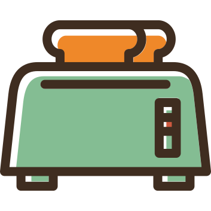

# Portals and Toast

## A fun tutorial on creating a Toast component with React

Please note that this is not a beginner level tutorial. You are expected to have a basic understanding of JavaScript and React before following this tutorial.

## Topics Covered

1. React portals
2. Closures
3. forwardRef
4. Memoization
5. useImperativeHandle

and more...
